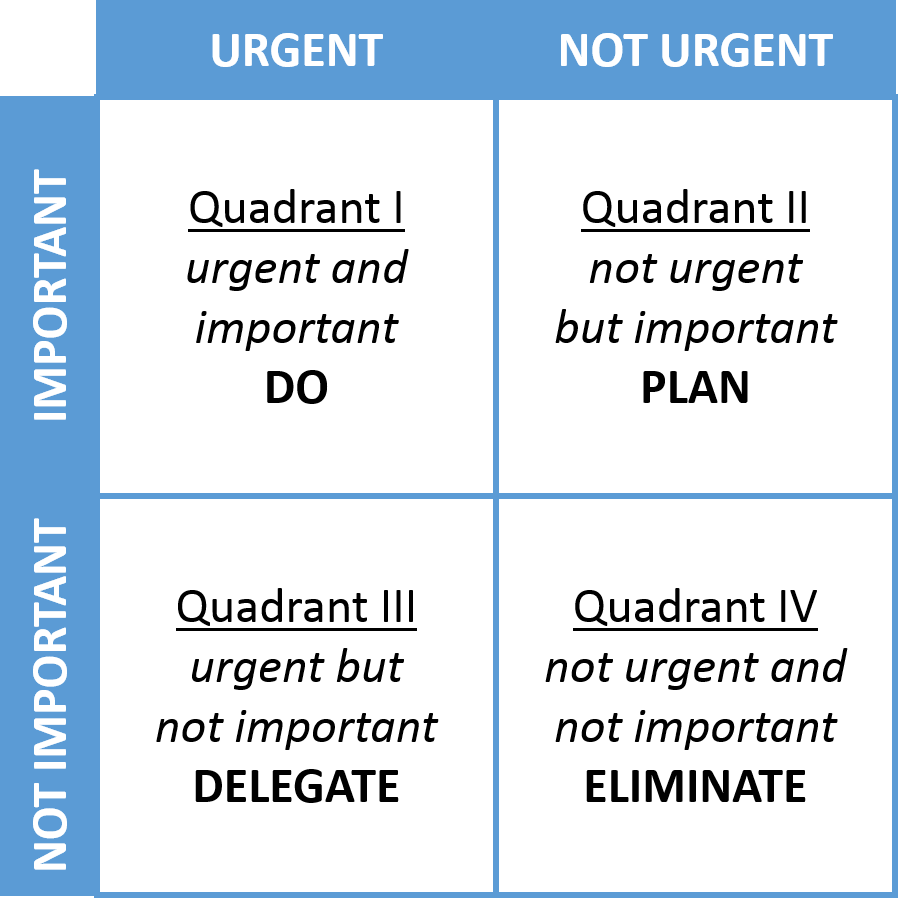

# Klokke - Time and Task Management Project

Welcome to the world's first project tracking system that has the user's personal growth and journey in mind. Now some of you may say, well I already have so many project management tools, Asana, Workfront, Jira, Trello. All these tools are amazing and do a very specific job very well. But who do they do a good job for?

**Your Boss?** 

**Or may be you favorite client?** 

**But what about you, personally?** 

## That is where Klokke Can Help
Following Stephen Covey's model for 7 habits for highly successful people, Klokke will help you set tasks by helping the user focus on their personal growth goals. Blending in your daily tasks with those that are required by your clients, bosses and co-workers. 

Starting right from the beginning with setting goals and then aligning your daily tasks to stated goals, help to keep you moving forward with out becoming overwhelmed. 

Tasks will be planned and organized using a prioritization matrix that ask the user to rank activities using an urgent vs important classification. Using this prioritization matrix will help break people from the habit of consistantly working in Quardant I (*Urgent **and** Important*) into a more managable Quadrant II (*Not Urgent **but** Important*)  

 

---

Please enjoy and provide any feedback you would like so that we can make the best possible human focused task and time management tool.

<!-- ToDo: Remove the original Read Me text before final publication

This is a very basic starting point for your projects.

As you find useful information, remember to add it to the [class-notes](https://github.com/USU-ITLS-x265-23-summer/class-repo).

## Extensions

I strongly recommend installing the [Live Server](https://marketplace.visualstudio.com/items?itemName=ritwickdey.LiveServer) extension.

VS Code and, by extension, the CodeSpace editor, come with built-in extensions.  One of these extensions has a snippets library that you should appreciate.  To see what I'm talking about, double-click to the `index.html` to the left of this editing and previewing area.  When `index.html` is the active editing file, type the letters `ht`, wait until you see a list apear, than select `html:5`.

## Git

The CodeSpace instance allows you to work completely independently on your code, but you still have to follow all the git steps to actually add the code to your project repo on GitHub.  If you look to the far left, you'll see a button that has 3 small circles & 2 lines.  If you've edited any files, you'll also see a blue dot with the count of edited files.  

Once there, read the ["Staging and committing code changes"](https://code.visualstudio.com/docs/sourcecontrol/intro-to-git#_staging-and-committing-code-changes) section and down.  

Do NOT follow anything before/above the "Staging and committing code changes" section — all of this is already configured when you created your CodeSpace from within the GitHub repo!

-->